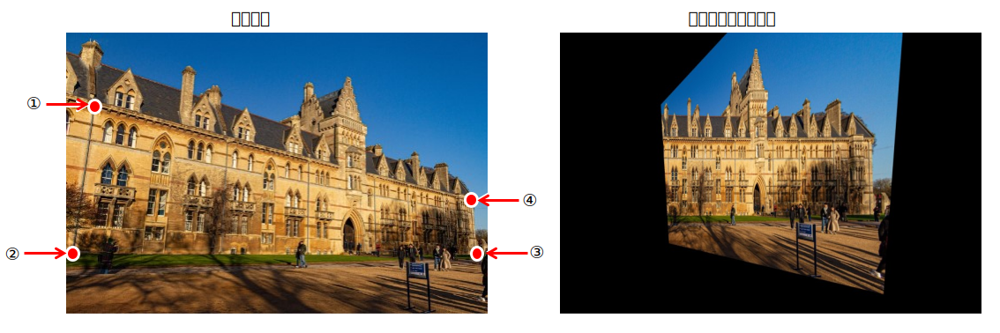
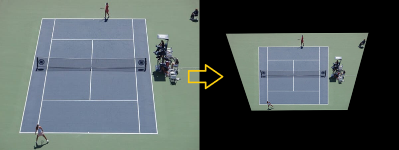
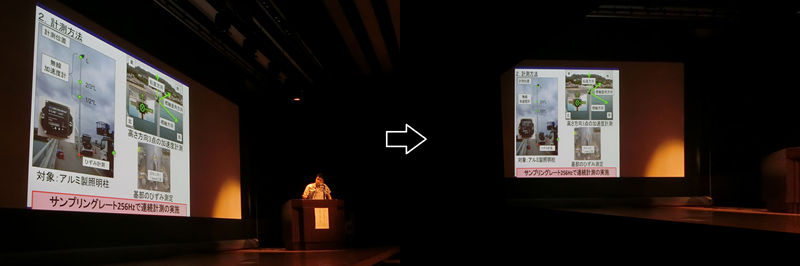

<html lang="ja">
    <head>
        <meta charset="utf-8" />
    </head>
    <body>
        <h1>
Homography
</h1>
        <h2>なにものか？</h2>
        

            画像内の４点を指定し、４点が矩形になるように射影変換した画像を出力します。 
             
            <h3>適用例</h3>
             
             
             
        

        <h2>環境構築方法</h2>
        

            pip install opencv-python 
        

        <h2>使い方</h2>
        

            python homography.py (画像ファイル名) 
             
            画像の表示サイズは+キー押下/-キー押下で調整できます。 
            矩形になるべき点を４点クリックします。 
            ESCキーを押下するとプログラムが終了します。 
            結果は homography.png に保存されます。 
        

    </body>
